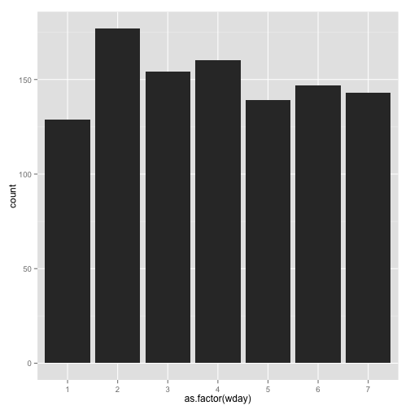

So this is my first EDA on this new data set, I downloaded the data from
killedbypolice.net and after some wrangling, I think I've turned it into 
an actual usable data set. For what yet, I dont' know.

At the end of this knitr document i create some csv files and a graph that
shows that the north east is way less eager to kill population than the south
west.

data sets:

* [full cleaned data](data/cleaned.csv)
* [summary by state](data/summaries_by_state.csv)
* [summary_by_state_and_race](data/summaries_by_state_and_race.csv)


```r
library(tidyr)
```

```
## Warning: package 'tidyr' was built under R version 3.1.2
```

```r
library(dplyr)
```

```
## 
## Attaching package: 'dplyr'
## 
## The following object is masked from 'package:stats':
## 
##     filter
## 
## The following objects are masked from 'package:base':
## 
##     intersect, setdiff, setequal, union
```

```r
library(lubridate)
library(Hmisc)
```

```
## Warning: package 'Hmisc' was built under R version 3.1.2
```

```
## Loading required package: grid
## Loading required package: lattice
## Loading required package: survival
## Loading required package: splines
## Loading required package: Formula
## 
## Attaching package: 'Hmisc'
## 
## The following objects are masked from 'package:dplyr':
## 
##     src, summarize
## 
## The following objects are masked from 'package:base':
## 
##     format.pval, round.POSIXt, trunc.POSIXt, units
```

```r
library(ggplot2)
library(maps)
library(rvest)
```

```
## 
## Attaching package: 'rvest'
## 
## The following object is masked from 'package:Hmisc':
## 
##     html
```

```r
library(httr)
```

```
## Warning: package 'httr' was built under R version 3.1.2
```

```r
data(state)
states_map <- map_data("state")
```


```r
# index.tidy.html was created using http://infohound.net/tidy/ from
# killedbypolice.net after some small manual editing (mainly deleting
# stuff that I knew would cause parsing headaches)
#
# tidy data/index.html > data/index.tidy.html

columns <- c("date", "state", "gender_race", "name_age", "kbp_link", "news_link")
killed_by_police <- html("data/index.tidy.html")
data <- killed_by_police %>% html_table(header=TRUE) %>% 
  .[[1]] %>%
  setNames(columns) %>%
  mutate(#first thing we have to do is split up columns w/multiple values
    gender=unlist(lapply(strsplit(as.character(gender_race), "\\/"), "[", 1)), 
    race=unlist(lapply(strsplit(as.character(gender_race), "\\/"), "[", 2)),
    name=unlist(lapply(strsplit(as.character(name_age), "\\,"), "[", 1)),
    age=unlist(lapply(strsplit(as.character(name_age), "\\, "), "[", 2)),
    first_name=unlist(lapply(strsplit(as.character(name), " "), "[", 1)),
    #throw out some cruft from some strings
    gender=substr(gender, 1, 1),
    race=substr(race, 1, 1),
    date=gsub("\\([^)]+) ", "", date),
    #make a real date object
    date=mdy(date),
    age=as.numeric(substr(age, 1, 2)),#centegenerians will be turned into teens
    gender=as.factor(gender),
    race=as.factor(race),
    first_name=as.factor(capitalize(tolower(first_name))),
    decade=as.factor(age %/% 10),
    state=as.factor(state.name[match(state, state.abb)]),
    wday=wday(date),
    mday=mday(date),
    month=month(date))
```

```
## Warning: 20 failed to parse.
```

```
## Warning in mutate_impl(.data, dots): NAs introduced by coercion
```

```r
write.csv(data, "data/cleaned.csv", row.names=FALSE)

state_population <- read.csv("data/state_population.csv") %>%
  filter(NAME %in% state.name)

summaries_by_state <- data %>% group_by(state) %>% 
  summarise(total=n(), 
            mean_age=round(mean(age, na.rm=TRUE))) %>% 
  inner_join(state_population, by=c("state" = "NAME")) %>% 
  select(state, mean_age, total, POPESTIMATE2014, 
         POPEST18PLUS2014) %>% 
  mutate(pctg=(total/POPESTIMATE2014)*100) %>% 
  arrange(state) %>%
  mutate(state=tolower(state)) %>% mutate(state_rank=rank(pctg))

write.csv(summaries_by_state, "data/summaries_by_state.csv", row.names=FALSE)

summaries_by_state_and_race <- data %>% group_by(state, race) %>% 
  summarise(total=n(), 
            mean_age=round(mean(age, na.rm=TRUE))) %>% 
  inner_join(state_population, by=c("state" = "NAME")) %>% 
  select(state, race, mean_age, total, POPESTIMATE2014, 
         POPEST18PLUS2014) %>% 
  mutate(pctg=(total/POPESTIMATE2014)*100) %>% 
  arrange(state) %>%
  #mutate(region=state.region[match(state.name[state], state.name)]) %>%
  mutate(state_rank=rank(pctg)) 

summaries_by_state_and_race$state <- tolower(summaries_by_state_and_race$state)


write.csv(summaries_by_state_and_race, "data/summaries_by_state_and_race.csv", row.names=FALSE)

pctg_map <- summaries_by_state %>% 
  inner_join(states_map, by=c("state" = "region")) %>% 
  arrange(group, order)

pctg_race_map <- states_map %>% left_join(summaries_by_state_and_race, by=c("region" = "state")) %>%
  arrange(group, order)

pctg_race_map <- summaries_by_state_and_race %>%
  left_join(states_map, by=c("state" = "region")) %>%
  arrange(group, order)

pctg_race_map <- merge(states_map, summaries_by_state_and_race, by.x="region", by.y="state", all.x=TRUE)
pctg_race_map <- arrange(pctg_race_map, group, order)

ggplot(pctg_map, aes(x=long, y=lat, group=group, fill=state_rank)) +
  geom_polygon(colour="black") + 
  scale_fill_gradient2(low="#559999", mid="grey90", high="#BB650B", 
                       midpoint=median(pctg_map$state_rank)) + 
  coord_map("polyconic") + 
  ggtitle("Ranking Percentage of Population Killed by Police by State")
```

 

```r
ggplot(pctg_race_map, aes(x=long, y=lat, group=group, fill=pctg)) +
  geom_polygon(colour="black") + 
  scale_fill_gradient2(low="#559999", mid="grey90", high="#BB650B", 
                       midpoint=median(pctg_map$pctg)) + 
  coord_map("polyconic") + 
  ggtitle("Ranking Percentage of Population Killed by Police by State") +
  facet_wrap(~ race)
```

 

```r
data <- data %>% filter(date > ymd("2014/01/01"))
```

You can also embed plots, for example:

 

Note you're most likely to get killed by police on Monday:


```r
ggplot(data, aes(x=as.factor(wday))) + geom_histogram()
```

 

The probability of being killed by a police officer falls off drastically
as men age, seems to stay more constant for longer for women (even though there
is less data, as women are simply killed less often):


```r
ggplot(data[complete.cases(data),], aes(x=age)) + geom_histogram(binwidth=10) + facet_wrap(~ gender, scales="free") + ggtitle("Violence by Police by Gender")
```

 

The south is active year round isn't it


```r
data$region = state.region[match(state.name[data$state], state.name)]

ggplot(data, aes(x=date)) + geom_histogram(binwidth=2563200, color="black", fill="white") + facet_wrap(~ region) + ggtitle("Deaths by Police Across Time by Region") + theme(axis.text.x = element_text(angle = 90, hjust = 1))
```

 

Surprised that police interactions peak in may and august:


```r
ggplot(data[complete.cases(data),] %>% filter(race == "B" | race == "W" | race == "L"), aes(x=as.factor(mday))) + 
  geom_histogram(fill="white", color="black") + 
  facet_grid(month~race) + ggtitle("Killed by Month by Day of Month")
```

 
